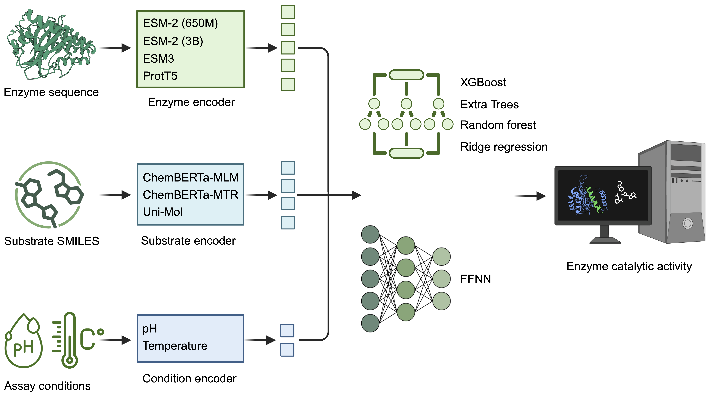

# [**EZKinetics**](https://github.com/le-yuan/EZKinetics) 

<!-- <p align="center">
  
</p> -->


## Introduction

Accurate prediction of enzyme catalytic activity, typically quantified by kinetic parameters such as enzyme turnover number (<i>k</i><sub>cat</sub>), Michaelis constant (<i>K</i><sub>m</sub>), and enzyme catalytic efficiency (<i>k</i><sub>cat</sub>/<i>K</i><sub>m</sub>), remains a fundamental challenge despite recent advances in machine learning (ML) and artificial intelligence (AI). Existing models often exhibit limited generalization to unseen or less-studied enzymes and fail to account for assay conditions (i.e., pH and temperature), with comparatively little attention given to <i>k</i><sub>cat</sub>/<i>K</i><sub>m</sub>, a key parameter for evaluating enzyme efficiency and enabling quantitative analysis and engineering of cellular systems. Here, we present EZKinetics, a ML framework for <i>k</i><sub>cat</sub>/<i>K</i><sub>m</sub> prediction that leverages pretrained large language models and substantially outperforms existing state-of-the-art AI models. Beyond <i>k</i><sub>cat</sub>/<i>K</i><sub>m</sub>, EZKinetics also enables accurate prediction of <i>k</i><sub>cat</sub> and <i>K</i><sub>m</sub>, consistently achieving substantial improvements over existing models while explicitly incorporating assay conditions for condition-aware prediction of enzyme catalytic activity. Notably, experimental validation on ene-reductase and ketoreductase across structurally diverse substrates demonstrates that EZKinetics maintains strong predictive performance, achieving Pearson correlation coefficients (PCCs) of 0.90 and 0.82, respectively, even for enzymes with low sequence similarity (<40%) to the training data. We anticipate that this tool will be widely adopted for predicting the catalytic activities of uncharacterized enzymes, thereby advancing many fields, such as synthetic chemistry, synthetic biology, biocatalysis, and enzyme engineering.


## Repository Structure

```text
EZKinetics/
├── code/                     # Python scripts for model training and evaluation
├── complementaryScripts/     # Complementary scripts for data downloading and processing
├── data/                     # Datasets used for model training
├── inference/                # Example files and scripts for model inference
├── model/                    # Pretrained EZKinetics models
├── picture/                  # Figures and images for project overview
├── LICENSE.md                # License information
├── README.md                 # Project README file
└── requirements.txt          # Python dependencies
```


## How to use

1. Install dependencies:
```linux
pip install -r requirements.txt
``` 
If the required packages are already installed, you can skip this step.

2. Navigate to the prediction directory:
```linux
cd inference
``` 

3. Run your predictions, please refer to the command line below:
```linux
python predict.py --input input_example.csv --output output_results.csv
```
This command will process the input file and generate prediction results in the specified output file.


## Citation

If you use **EZKinetics** in your research, please cite:

> Le Yuan, Zhengyi Zhang, and Huimin Zhao. (2026). **EZKinetics: a Machine Learning Framework for Enzyme Catalytic Activity Prediction.** *Manuscript under consideration*.


## Contact

-   Le Yuan ([@le-yuan](https://github.com/le-yuan)), University
    of Illinois Urbana-Champaign, Urbana, IL, USA

